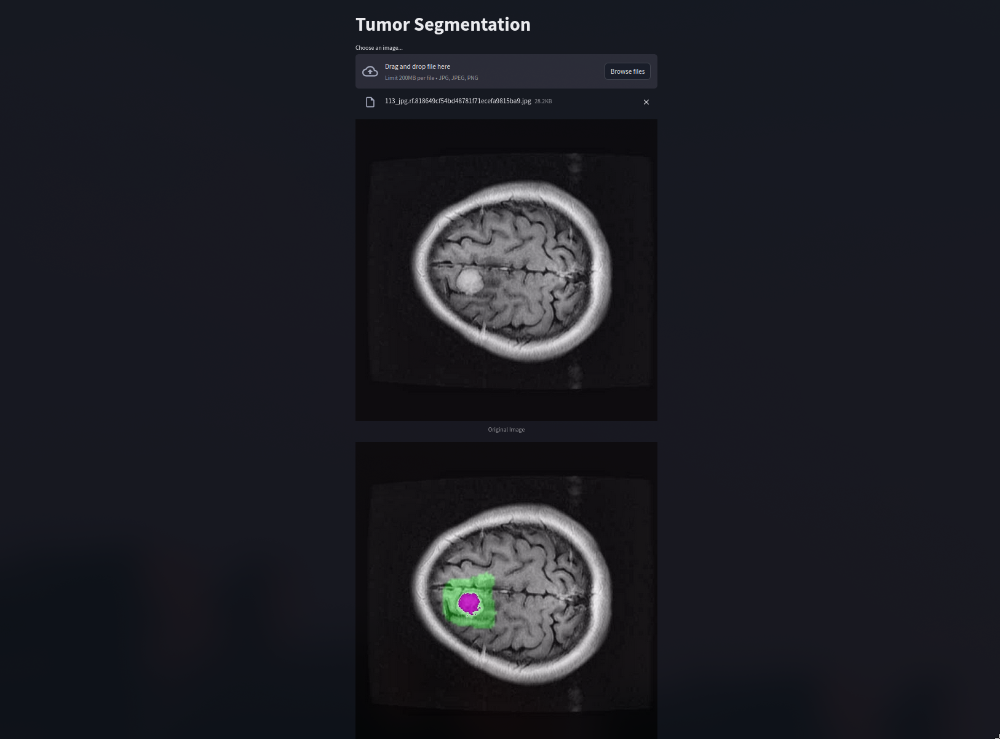

## Innopolis University PMLDL course assignment 1

### Main Task

In this task I need to deploy a model in an API and create a web application that interacts with the API.
The model API accepts the requests from the web application and sends back the responses.

### Methodology
I have decided to use the [TumorSegmentation](https://www.kaggle.com/datasets/pkdarabi/brain-tumor-image-dataset-semantic-segmentation/data) dataset,
which contains 2146 images. As for the model I have trained Unet model. 

To implement the api I have used FastAPI framework and Streamlit for web application.

### How to run

To run the api you should have `docker` with `docker-compose` plugin installed. You also probably need cuda device.

To run the application, inside the main directory of the project, run:
```
cd code/deployment
docker-compose up --build
```

Proceed to `0.0.0.0:8501` in your browser. The web application is ready to use.
